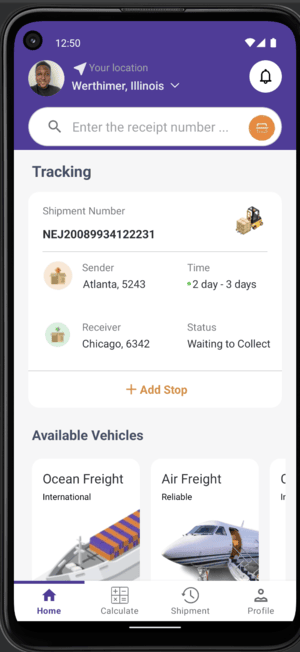

# MoveMate

## Overview

MoveMate is a basic mobile app featuring smooth animations, designed to showcase how a real-world logistics application might look.

The design was created by Musemind UI/UX, and I translated it into a mobile app focused solely on the UI (this version does not include functionality).

You can view the original design here:  
[https://dribbble.com/shots/21617837-Movemate-Shipments-Mobile-App](https://dribbble.com/shots/21617837-Movemate-Shipments-Mobile-App)

## Features

- Shipment tracking with a search function
- Delivery cost estimation based on various parameters
- Shipment history with status updates and shipment summaries

## Architecture

The application is organized into three main layers:

1. **Domain Layer**: Contains business logic and application rules, defining use cases and models.
2. **Data Layer**: Manages data sources, including Room database and any remote data sources.
3. **UI Layer**: Handles data presentation and user interactions.

## Technologies Used

- **Kotlin**: Programming language for Android development
- **Jetpack Navigation Controller** with options menu
- **CollapsingToolbarLayout**
- **RecyclerView**
- **TabLayout**

## Tests

There are currently no automated tests included.

## Getting Started

### Prerequisites

- Android Studio
- Kotlin SDK
- Gradle

### Installation

1. Clone the repository:
   ```bash
   git clone https://github.com/Jayhymn/movemate

### Screenshots
### Light Mode



### Dark Mode
The App can work in Dark Mode but the color scheme will need some improvements
```
